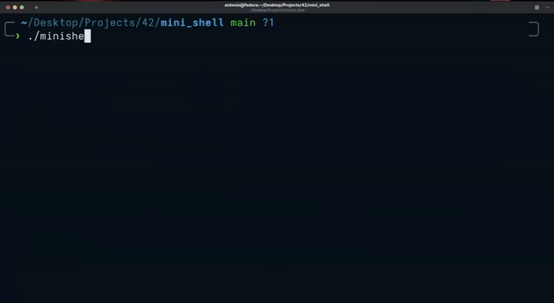

# Minishell - Graded 123/100 (23/25 Bonus)
> A lightweight yet powerful Unix shell designed for simplicity, efficiency, and educational excellence.



> Colors were not mandatory, we put them "for the vibe"

## Introduction
Welcome to Minishell – the minimal shell that gets straight to the point. We know most people will only read this introduction, so here’s everything you need to know: Minishell is built to execute commands, handle built-in functions, and support essential piping and redirection features. Inspired by the rigorous requirements of the 42 Ecole Minishell project, it offers an immersive learning experience on Unix internals, while delivering a practical, fully functional shell.

## Table of Contents
- [Features](#features)
- [Installation](#installation)
- [Usage](#usage)
- [Detailed Functionality and Implementation](#detailed-functionality-and-implementation)
- [Testing & Development](#testing--development)
- [Requirements](#requirements)
- [Acknowledgments](#acknowledgments)

## Features
- **Command Execution:** Searches and executes external commands via the system’s PATH.
- **Built-In Commands:** Implements essential built-ins like `cd`, `echo`, `exit`, `env`, `pwd`, `export`, and `unset`.
- **Piping & Redirection:** Supports pipes (`|`) and redirection operators (`<`, `>`, `>>`, `<<`) for flexible command chaining and input/output handling.
- **Signal Handling:** Gracefully manages signals such as interrupts (`Ctrl+C`) and end-of-file (`Ctrl+D`) plus `Ctrl+\` to ensure a smooth user experience.
- **Environment Variable Expansion:** Dynamically replaces tokens prefixed with `$` to reflect the current environment variables.
- **Robust Error & Memory Handling:** Emphasizes error detection and dynamic memory management to avoid leaks and guarantee stability.

## Installation
Follow these steps to set up Minishell:

1. **Clone the Repository:**
    ```bash
    git clone https://github.com/denuen/mini_shell.git
    cd mini_shell
    ```

2. **Compile the Source:**
    ```bash
    make
    ```
    *Note:* Ensure you have `gcc` (or a compatible C compiler) and GNU Make installed.

3. **Run Minishell:**
    ```bash
    ./mini_shell
    ```

## Usage
Interact with Minishell just as you would with any standard Unix shell:

- **Execute Commands:** Type any command and press Enter.
- **Built-In Functions:** Use commands like `cd`, `echo`, `exit`, and `env` for built-in tasks.
- **Redirection & Piping:** Utilize operators such as `>` (output redirection), `<` (input redirection), and `|` (command piping) to streamline your workflow.
- **Help:** Type `help` inside the shell to display available commands and usage information.

## Detailed Functionality and Implementation
Minishell is more than a basic command interpreter—it is a comprehensive educational project designed to meet the strict criteria of the 42 curriculum. Below is an in-depth breakdown of its functionality and implementation:

### 1. Command Parsing and Tokenization
- **Input Handling:** Reads user input character by character to manage whitespace, quotes, and special symbols.
- **Quotation Support:** Processes both single (`' '`) and double (`" "`) quotes to ensure correct interpretation of compound commands and arguments.
- **Tokenization:** Breaks down the input into meaningful tokens (commands, arguments, operators) for subsequent processing.

### 2. Built-In Commands and Environment Management
- **Built-In Implementation:** Offers core commands like:
  - `cd` for directory navigation,
  - `echo` for text display,
  - `exit` for terminating the shell,
  - `env` for environment variable listing.
- **Dynamic Environment Variables:** Replaces `$VARIABLE` tokens with values from the current environment, enabling dynamic command contexts.

### 3. Process Creation and Execution
- **Forking Processes:** Uses `fork()` to create child processes for executing non-built-in commands.
- **Command Execution:** Utilizes `execve()` within child processes, searching for the command executable via the system’s PATH.
- **Process Synchronization:** The parent process employs `waitpid()` to synchronize and retrieve the exit statuses of child processes.

### 4. Piping and Redirection
- **Piping:** Implements inter-process communication by linking the standard output of one process directly to the standard input of another.
- **Redirection Mechanics:**
  - **Input Redirection (`<`):** Reads input from specified files.
  - **Output Redirection (`>`):** Writes or overwrites output to files.
  - **Append Redirection (`>>`):** Appends output to existing files.
  - **Heredoc (`<<`):** Supports multi-line input until a designated delimiter is encountered.
- **Error Handling:** Provides user-friendly error messages for incorrect usage of redirection and piping.

### 5. Signal and Memory Management
- **Signal Handling:** Catches interrupts (e.g., `Ctrl+C`) and handles EOF scenarios (e.g., `Ctrl+D`) without crashing the shell.
- **Memory Management:** Carefully manages dynamic memory to prevent leaks, a critical aspect of robust Unix system programming.
- **Error Reporting:** Displays meaningful error messages for both command and system call failures, ensuring clear communication with the user.

### 6. Educational Objectives and 42 Subject Requirements
- **Learning Focus:** Every aspect of Minishell—from process creation to memory management—is designed to teach real-world Unix programming principles.
- **Strict Adherence:** The project strictly adheres to the guidelines provided by the 42 curriculum, offering hands-on experience in building a fully functional shell.

## Testing & Development
- **Automated Tests:** While not mandatory, adding unit tests and integration tests is highly recommended to catch potential issues early. Consider using frameworks like CUnit for testing C programs.
- **Debugging:** Use tools such as `gdb` for debugging and valgrind to detect memory leaks, ensuring that Minishell performs reliably under various conditions.
- **Continuous Integration:** For advanced setups, integrate CI/CD pipelines (e.g., GitHub Actions) to automatically build and test the project on new commits.

## Requirements
- **System:** Unix or Linux environment.
- **Compiler:** `gcc` (or a similar C compiler).
- **Build Tool:** GNU Make.
- **Standards Compliance:** The code should adhere to the Norme, as stipulated by the 42 school guidelines.

If you encounter any issues or have improvement suggestions, please open an issue on the repository.

## Acknowledgments
- **Community:** Thanks to the active developer community and all 42 students whose shared experiences and resources have shaped this project.
- **42 Ecole:** Special recognition to Ecole 42 for fostering an environment of innovation and rigorous learning.
- **Contributors:** apintaur (denuen) & ahabdelr (ahmeee-dev)

---

*Enjoy using Minishell, and happy coding!*
